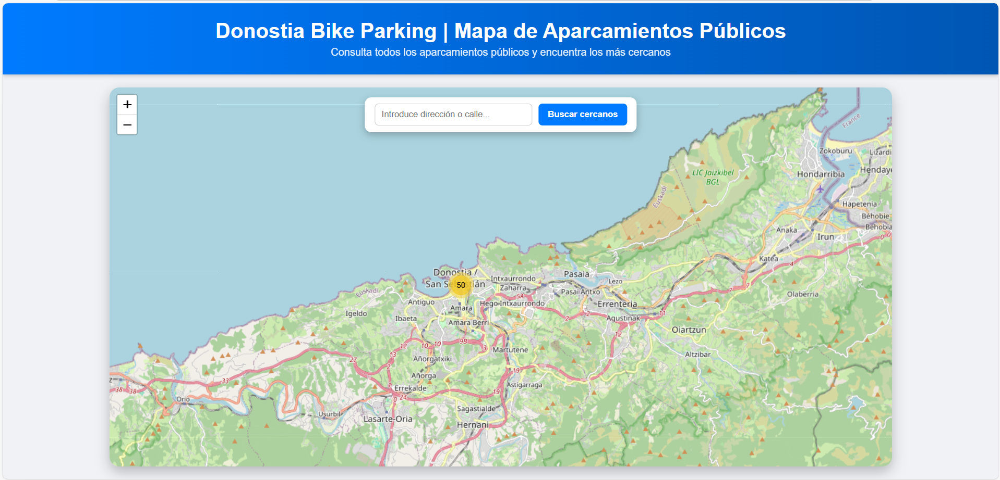
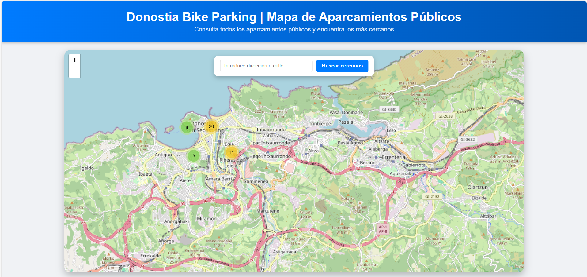
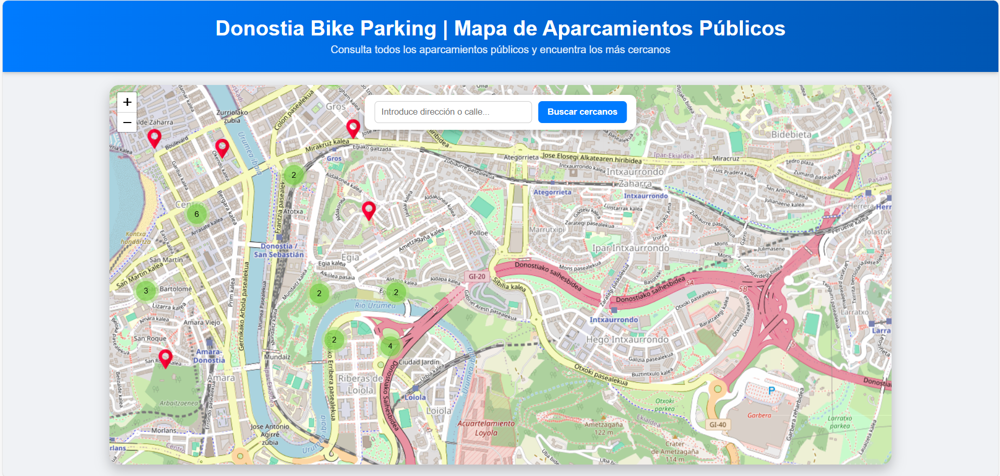
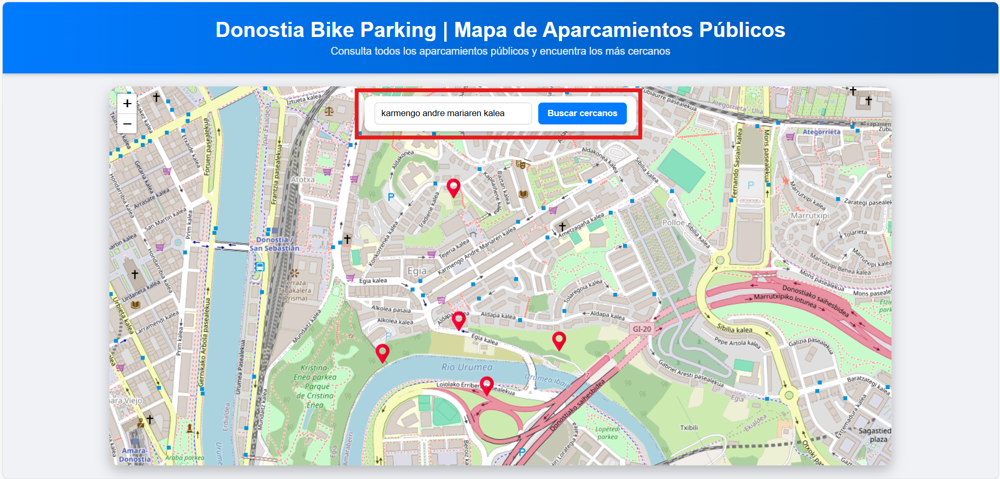

**Título del Proyecto:**
Donostia Bike Parking

**Descripción del problema:**
San Sebastián cuenta con una creciente red de aparcamientos públicos para bicicletas, pero no existe una herramienta digital que permita visualizarlos de manera clara e interactiva.

**Origen de los datos:**
https://www.donostia.eus/datosabiertos/recursos/bicicleta-aparcamiento-publico/bizikletaaparkalekuak.json

**Valor aportado:**
Una página web que cuenta con un mapa intuitivo que muestre la ubicación de
todos los aparcamientos y permita planificar rutas en la ciudad. Los usuarios
podrán buscar aparcamientos por proximidad a estaciones de transporte, zonas turísticas o áreas urbanas de interés. Además, se incluirá un análisis de densidad por zona, ayudando a identificar áreas con mayor o menor cobertura. Con esto, se facilita la movilidad sostenible y se promueve un uso seguro y eficiente de la bicicleta como medio de transporte. Será compatible con todo tipo de dispositivos para que cualquiera pueda acceder a ella sin importar su móvil u ordenador.

**Aplicación en funcionamiento:**
Primero agrupa los 50 aparcamientos.

Según se amplía van creándose grupos más pequeños.

Y cuando se amplía lo suficiente aparecen los puntos con la ubicación exacta.

También cuenta con un buscador que encuentra los 5 aparcamientos más cercanos a la ubicación deseada.

